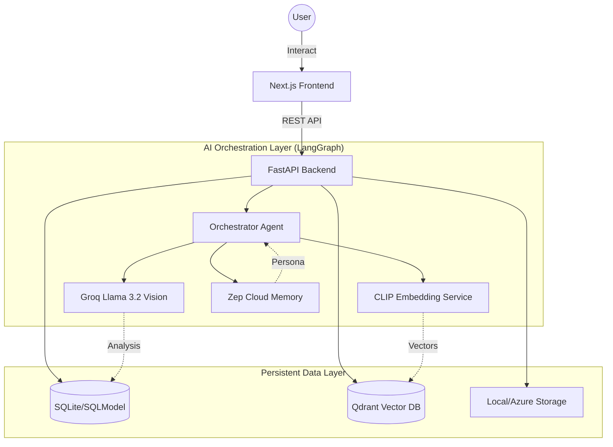

# Vector in Orbit Hackathon - Use Case 2: Virtual Closet & Personal Stylist
## Project: Glam FinCommerce

Glam FinCommerce is an implementation for **Vector in Orbit Hackathon - Use Case 2**. It is a state-of-the-art digital wardrobe management and AI-driven fashion commerce platform. It leverages **vision-language models (Llama 3.2 Vision)** and **multi-modal embeddings (CLIP)** to help users organize their wardrobe, generate cohesive outfits, and receive intelligent shopping advice that considers their existing clothing collection.

---

## 🚀 Key Features

*   **Digital Wardrobe Management**: Upload clothing items and let AI automatically categorize, describe, and analyze them.
*   **AI Shopping Advisor**: Upload a photo of a piece you're thinking of buying, and the AI will analyze how well it fits with your current wardrobe (using visual similarity and style matching).
*   **Personalized Outfit Generation**: Get outfit suggestions based on your personal style and the occasion.
*   **Visual & Semantic Search**: Find items in your closet using images or natural language queries (e.g., "Find my favorite blue summer dress").
*   **Style DNA & User Profiling**: Automatically builds a "Style DNA" profile (vibes, color palettes, body morphology) to provide hyper-personalized recommendations.
*   **Pinterest Connectivity**: Sync your Pinterest boards to refine your AI style profile.

---

## 🛠️ Technology Stack

### Backend
- **Framework**: [FastAPI](https://fastapi.tiangolo.com/) (Python 3.10+)
- **Database**: [SQLModel](https://sqlmodel.tiangolo.com/) (SQLAlchemy + Pydantic) with SQLite
- **Vector Database**: [Qdrant](https://qdrant.tech/) (Cloud & Local)
- **AI/ML Orchestration**: [LangGraph](https://www.langchain.com/langgraph) & [LangChain](https://www.langchain.com/)
- **Embeddings**: [OpenAI CLIP (ViT-B/32)](https://huggingface.co/openai/clip-vit-base-patch32)
- **Vision AI**: [Groq Llama 3.2 Vision](https://groq.com/)
- **Profiling**: [Zep Cloud](https://www.getzep.com/) (Long-term memory for AI agents)

### Frontend
- **Framework**: [Next.js 15+](https://nextjs.org/)
- **Library**: [React 19](https://react.dev/)
- **Language**: [TypeScript](https://www.typescriptlang.org/)
- **Styling**: Vanilla CSS with CSS Modules

---

## 🏗️ Project Architecture & Data Flow

Glam FinCommerce follows a modern distributed architecture, separating the heavy lifted AI orchestration (Backend) from the interactive user experience (Frontend).

### Architecture Diagram


### 📁 Project Hierarchy
```text
glam-fincommerce-main/
├── backend/                # FastAPI Application
│   ├── app/
│   │   ├── agents/         # AI Agents (Orchestrator, Advisor, prompts)
│   │   ├── api/            # REST Endpoints (closet, outfits, stylist, brands)
│   │   ├── core/           # Config, Security, Database session
│   │   ├── models/         # SQLModel database schemas
│   │   ├── schemas/        # Pydantic request/response models
│   │   └── services/       # Core Business Logic
│   │       ├── brand_ingestion/    # Web scraping & brand data processing
│   │       ├── clip_qdrant_service.py # Vector DB & CLIP Integration
│   │       ├── outfit_composer.py  # AI Outfit logic
│   │       └── style_dna_service.py # User profiling logic
│   ├── seed_demo_data.py   # Curated dataset for testing
│   └── init_db.py          # Database initialization
├── frontend/               # Next.js Application
│   ├── app/                # Pages & Routes (App Router)
│   ├── components/         # Reusable UI (AI Stylist, Outfit Creator, Style DNA)
│   ├── lib/                # API clients and utilities
│   └── public/             # Static assets
└── README.md               # Documentation
```

---

## 🔍 Qdrant Integration: Technical Deep Dive

Qdrant serves as the **Vector Search Engine** that powers Glam FinCommerce's visual intelligence. Unlike traditional databases, Qdrant allows us to understand the *content* of an image rather than just its tags.

### 1. Multi-Modal CLIP Architecture
We integrated the **OpenAI CLIP (Contrastive Language-Image Pretraining)** model (`clip-vit-base-patch32`). CLIP is unique because it was trained to map both images and text into the **same 512-dimensional vector space**.

- **Implementation**: See `backend/app/services/clip_qdrant_service.py`.
- **Image Embedding**: When a user uploads a piece of clothing or a shopping item, the image is passed through the CLIP Vision Transformer. The resulting vector represents the "visual style" (color, shape, pattern, texture).
- **Text Embedding**: When a user types a search query, it is passed through the CLIP Text Encoder. Because images and text share the same space, we can mathematically "compare" a text vector to an image vector.

### 2. Multi-Modal Search Capabilities

#### 🖼️ Image-to-Image Search (Visual Lookalike)
Used in the **Shopping Advisor**. 
1. The user uploads a photo of a "potential purchase."
2. The system generates a CLIP vector for that photo.
3. We perform a `search` in Qdrant with a **Cosine Similarity** threshold.
4. **Result**: The system finds exactly which items in your closet *look* like that item, identifying redundancies or perfect matches instantly.

#### 🔤 Text-to-Image Search (Semantic Discovery)
Used in the **Virtual Closet Search**.
1. User types: *"something elegant for a summer wedding"*.
2. The system converts this natural language into a 512-dimension CLIP text vector.
3. Qdrant scans the closet collection and returns images whose visual features have the highest semantic correlation with the text.
4. **Complexity**: This allows searching for abstract concepts (vibes) that aren't explicitly tagged in a database.

### 3. High-Performance Payload Indexing
To ensure scalability and security, we don't just store vectors. We use Qdrant's **Payload** feature to store metadata and perform filtered searches:

- **Collection**: `clothing_embeddings_clip`
- **Vector Size**: 512 dimensions.
- **Payload Indexes**: We explicitly create indexes on the following fields to ensure millisecond response times even with thousands of items:
    - `user_id` (Filtered per user for security).
    - `clothing.category` (e.g., Top, Bottom, Shoes).
    - `clothing.colors` (Primary and secondary colors).
    - `clothing.vibe` (Minimalist, Chic, Streetwear, etc.).
- **Hybrid Storage**: We store the **Base64 encoded image** directly inside the Qdrant payload. This eliminates the need for a separate image database for the visual search results, making the system architecture extremely lean and fast.

### 4. Code Implementation Highlight
The integration is abstracted into a robust service layer:
- `generate_image_embedding()`: Handles Torch/Transformers logic for image processing.
- `search_similar_clothing_by_image()`: Implements the similarity threshold logic to determine if a new purchase is "redundant."
- `filter_user_items()`: Combines vector similarity with hard metadata filters for precise results.

---

## �️ Commercial Intelligence: Shop Recommendations & CTR

Glam FinCommerce isn't just a closet app; it's a **bridging platform for retailers**. We implemented a sophisticated recommendation and analytics engine that tracks **Click-Through Rate (CTR)** and maximizes user engagement.

### 1. DNA-Based Shop Personalization
In the "Explore" section, the platform aggregates product catalogs from multiple clothing brands. Using the user's **Style DNA** (generated from their closet analysis and Pinterest sync), we dynamically score external products.
- **Vibe Matching**: If a user's closet is 40% "Chic", products tagged as "Chic" receive a score boost.
- **Color Harmony**: Products that match the user's preferred color palette (detected via CLIP) are prioritized.
- **Dynamic Sorting**: Brands' catalogs are re-ordered in real-time to show the most relevant items first, increasing the probability of a conversion.

### 2. Analytics & CTR Tracking
We built a specialized telemetry system (see `backend/app/api/brands.py`) to track retail performance:
- **Impressions**: Automatically logged when a product appears in the user's personalized feed.
- **Engagement (Click)**: Logged when a user clicks to view product details.
- **Purchase Intent**: Logged when a user clicks the external link to the brand's store.
- **CTR Calculation**: By logging these events (Impression vs. Click vs. Purchase), retailers can calculate the **CTR** and **Conversion Rate** for specific demographics.

---

## �📦 Setup and Installation

### Prerequisites
- Python 3.10+
- Node.js 18+
- API Keys: Groq, Qdrant (Cloud), Zep Cloud, Pinterest (optional).

### Backend Setup
1.  **Navigate to backend**:
    ```bash
    cd backend
    ```
2.  **Create and activate virtual environment**:
    ```bash
    python -m venv venv
    source venv/bin/activate  # On Windows: venv\Scripts\activate
    ```
3.  **Install dependencies**:
    ```bash
    pip install -r requirements.txt
    ```
4.  **Configure Environment**:
    Create a `.env` file in the `backend/` directory:
    ```env
    GROQ_API_KEY=your_key
    QDRANT_URL=your_qdrant_url
    QDRANT_API_KEY=your_qdrant_key
    ZEP_API_KEY=your_zep_key
    ```
5.  **Initialize Database**:
    ```bash
    python init_db.py
    python seed_demo_data.py
    ```
6.  **Run Server**:
    ```bash
    uvicorn app.main:app --reload
    ```

### Frontend Setup
1.  **Navigate to frontend**:
    ```bash
    cd frontend
    ```
2.  **Install dependencies**:
    ```bash
    npm install
    ```
3.  **Run Development Server**:
    ```bash
    npm run dev
    ```
    The application will be available at `http://localhost:3000`.

---

## 📖 Usage Examples

### 1. Adding an Item to Your Closet
Go to the **Upload** page, snap a photo of your shirt. The AI uses **Llama 3.2 Vision** to identify that it's a "Blue Linen Shirt" with a "Beach Vibe" and stores its **CLIP vector** in Qdrant.

### 2. The Shopping Advisor
Upload a photo of a dress you see in a store. The AI will:
1. Generate an embedding for the new dress.
2. Search your Qdrant `clothing_embeddings_clip` collection for similar items.
3. Use the **Orchestrator Agent** to tell you: *"You already have a similar blue midi dress, but this one has a more formal cut which would complement your black blazer."*

---


## 📄 License
This project is licensed under the MIT License - see the LICENSE file for details.
